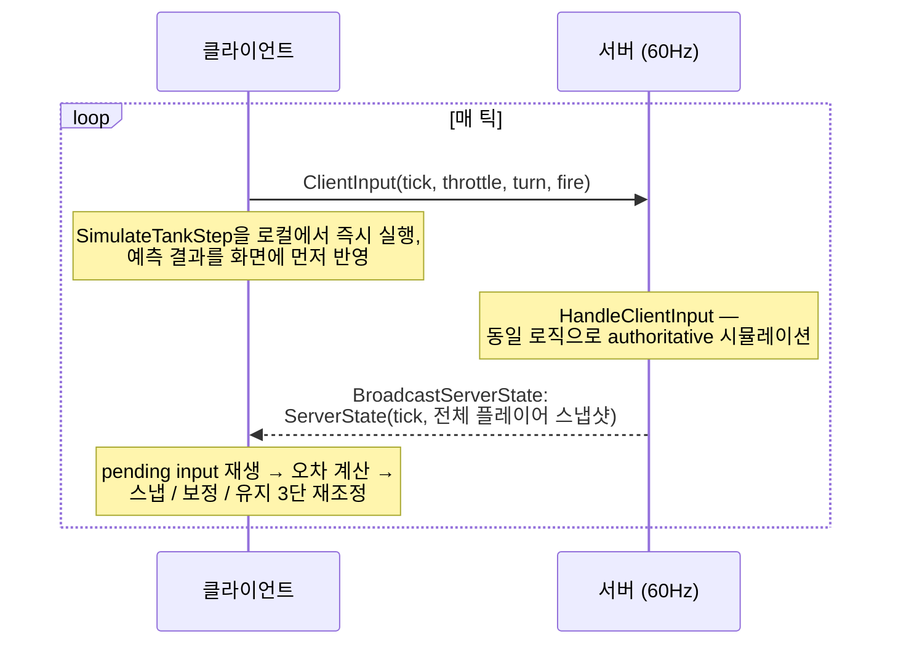

# Custom UDP Server-Authoritative Multiplayer Framework

Unity의 Dedicated Server(Netcode for GameObjects, Unity Transport 등)에 의존하지 않고, **순수 C# 콘솔 애플리케이션으로 작성한 UDP 서버**를 중심으로 한 Server-Authoritative 멀티플레이어 아키텍처 검증 프로젝트입니다.

서버는 Unity 런타임과 완전히 분리되어 있으며, 동일한 서버에 **MonoBehaviour 클라이언트**와 **DOTS/ECS 클라이언트**가 동시에 접속해 같은 게임을 플레이할 수 있음을 검증합니다. 또한 실제 유저 없이도 수십~수백 명 규모의 세션을 재현할 수 있는 **자체 부하 테스트 봇(Load Test Bot)** 을 포함합니다.

> 프로젝트 목적: Unity Dedicated Server 패키지가 강제하는 Netcode 종속성, 빌드 파이프라인, 라이선스 비용 없이도 순수 C# 서버 + 커스텀 바이너리 프로토콜만으로 프로덕션 수준의 클라이언트 예측/재조정 멀티플레이어를 구현할 수 있는지를 검증하는 프로젝트입니다.

---

## 1. Pure C# 서버

| 항목 | Unity Dedicated Server (NGO 등) | 본 프로젝트 (Custom C# Server) |
|---|---|---|
| 런타임 | Unity Player 빌드 필요 (headless 엔진 초기화 비용 존재) | .NET 콘솔 앱, Unity 엔진 의존성 0 |
| 배포 | 플랫폼별 빌드 파이프라인 필요 | `dotnet publish` 하나로 Linux 컨테이너 배포 가능 |
| 틱레이트 제어 | Unity FixedUpdate/PlayerLoop에 종속 | `Thread.Sleep` 기반 자체 루프로 완전한 제어 |
| 확장성 | GameObject/Component 오버헤드 존재 | `ConcurrentDictionary` 기반 순수 데이터 구조 |
| 스케일 아웃 | 엔진 라이선스/계정 단위 적용 대상 | 표준 서버 프로세스, 오케스트레이션 자유도 높음 |

서버는 `System.Net.Sockets.UdpClient` 으로 구현되어 있으며, Unity API를 전혀 참조하지 않습니다(`CustomServer.cs` 확인 시 `using UnityEngine`이 없음). 이 덕분에 Docker 컨테이너, 리눅스 베어메탈, 서버리스 컨테이너 등 어디에도 그대로 배포할 수 있습니다.

---

## 2. 네트워크 아키텍처 — Server-Authoritative + Client-Side Prediction

Photon Fusion 2, Rocket League의 GGPO 이전 방식과 유사한 **"서버가 Source of Truth를 계산하고, 클라이언트는 예측 후 서버 값으로 보정"** 하는 구조입니다.



### 2.1 서버 틱 루프

서버는 별도 스레드에서 60Hz 고정 주기로 시뮬레이션과 브로드캐스트를 수행합니다.

```csharp
private void ServerLoop()
{
    int serverTick = 0;
    int intervalMs = (int)(1000f / TICK_RATE);
    float dt = 1.0f / TICK_RATE;

    while (_isRunning)
    {
        serverTick++;

        CheckTimeouts();
        CheckRespawns();
        UpdateMissiles(dt);
        BroadcastServerState(serverTick);
        BroadcastMissileState(serverTick);
        BroadcastScoreboardState();

        Thread.Sleep(intervalMs);
    }
}
```

수신은 별도의 블로킹 `UdpClient.Receive` 스레드에서 처리되고, `ConcurrentDictionary<byte, PlayerState>`로 스레드 안전성을 확보합니다. 즉 **수신 스레드 / 시뮬레이션 스레드가 분리된 이중 스레드 모델**입니다.

### 2.2 클라이언트 예측 (Client-Side Prediction)

클라이언트는 서버 응답을 기다리지 않고 입력을 로컬에서 즉시 시뮬레이션해 반응성을 확보합니다. 이때 사용하는 이동 공식(`SimulateTankStep`)은 서버의 `HandleClientInput`과 **바이트 단위까지 동일한 계산 순서**로 유지해야 합니다.

```csharp
// 순서: 1) 회전  2) 목표 속도로 가감속  3) 이동  4) 위치만 경계 wrap.
public static void SimulateTankStep(SimulationConfig config, ref float2 pos, ref float rotDeg, ref float speed,
    float throttle, float turn, float dt)
{
    // 1) 회전
    rotDeg += turn * config.TurnSpeedDeg * dt;
    rotDeg %= 360f;
    if (rotDeg < 0f) rotDeg += 360f;

    // 2) 목표 속도로 가속/감속
    float targetSpeed = throttle >= 0f ? throttle * config.MaxForwardSpeed : throttle * config.MaxReverseSpeed;
    float speedDelta = config.Acceleration * dt;
    speed = (speed < targetSpeed)
        ? Mathf.Min(speed + speedDelta, targetSpeed)
        : Mathf.Max(speed - speedDelta, targetSpeed);

    // 3) 전진/후진 (0도 = +Y, 시계방향 증가)
    float rotRad = rotDeg * Mathf.Deg2Rad;
    float2 dir = new float2(Mathf.Sin(rotRad), Mathf.Cos(rotRad));
    pos += dir * speed * dt;

    // 4) 화면 경계 wrap (clamp하지 않고 반대편에서 재등장)
    pos.x = WrapCoordinate(pos.x, config.ServerWorldHalfExtent.x);
    pos.y = WrapCoordinate(pos.y, config.ServerWorldHalfExtent.y);
}
```

이 함수는 MonoBehaviour 클라이언트(`CustomClient.cs`)와 ECS 클라이언트(`LocalPlayerFixedStepSystem.cs`) 양쪽에 **동일한 로직으로 이식**되어 있어, 두 클라이언트 구현체가 항상 같은 예측 결과를 내도록 보장합니다.

### 2.3 서버 재조정 (Reconciliation)

서버 스냅샷이 도착하면, 이미 처리된 pending input을 제거하고 남은 입력만 재생해 예측 오차를 계산합니다. 오차 크기에 따라 **스냅(즉시 이동) / 보정(오프셋 흡수) / 유지** 3단계로 처리해 순간이동처럼 보이는 튐(Pop)을 최소화합니다.

```csharp
// 위치: 스냅 / 보정(오프셋 흡수) / 유지 3단 처리
if (posErrorSqrMag > config.SnapThreshold * config.SnapThreshold)
{
    predicted.Position = reconciledPos;   // 오차가 너무 크면 즉시 스냅
    offset.Position = float2.zero;
}
else if (posErrorSqrMag > config.ErrorThreshold * config.ErrorThreshold)
{
    predicted.Position = reconciledPos;   // 값은 갱신하되
    offset.Position -= posError;          // 화면 표시는 오프셋으로 서서히 흡수 (RenderErrorOffset)
}
// else: 오차가 미미할 경우 아무것도 하지 않음 (예측 유지)
```

이후 `LocalPlayerRenderSmoothingSystem`이 매 프레임 `RenderErrorOffset`을 0으로 Lerp 감쇠시켜, 위치 보정이 눈에 띄는 튐 없이 부드럽게 흡수되도록 합니다. 이는 **Rollback 없는 Error-Smoothing 재조정** 방식으로, Fusion 2의 Soft/Hard Correction과 개념적으로 동일합니다.

### 2.4 경계 처리 — Wrap 좌표계와 재조정의 상호작용

화면 경계에서 클램프(Clamp) 대신 **반대편 재등장(Wrap)** 방식을 채택했는데, 이 경우 위치 차이를 단순 뺄셈으로 구하면 wrap 경계를 걸친 순간 거대한 오차로 오인될 수 있습니다. 최단 경로 기준으로 오차를 재계산하는 처리가 서버·양쪽 클라이언트 모두에 동일하게 구현되어 있습니다.

```csharp
private static float WrapCoordinate(float value, float halfExtent)
{
    float range = halfExtent * 2f;
    float shifted = value + halfExtent;      // [-half, +half) -> [0, range)
    float wrapped = shifted % range;
    if (wrapped < 0f) wrapped += range;      // C# 음수 % 보정
    return wrapped - halfExtent;             // 다시 [-half, +half)
}
```

---

## 3. 원격 플레이어 보간 (Entity Interpolation)

본인 캐릭터는 예측+재조정으로 처리하지만, 원격 플레이어는 예측할 입력 정보가 없으므로 **과거 스냅샷 두 개 사이를 보간**해 부드럽게 표시합니다. 렌더링은 항상 `Time.time - InterpolationDelay` 시점을 목표로 하여, 네트워크 지터를 흡수하는 버퍼 역할을 합니다.

```csharp
float renderTime = Time.time - config.InterpolationDelay;

int index = 0;
while (index < headers.Length && headers[index].LocalTimeStamp < renderTime) index++;

// index 앞뒤 두 스냅샷 사이를 t로 보간
float t = (renderTime - h1.LocalTimeStamp) / (h2.LocalTimeStamp - h1.LocalTimeStamp);
rt.Position = LerpWrapped(s1.Position, s2.Position, t, config.ServerWorldHalfExtent);
rt.RotationDeg = Mathf.LerpAngle(s1.RotationDeg, s2.RotationDeg, t);
```

Wrap 좌표계이므로 일반 `Lerp` 대신 **최단 경로 보간(`LerpWrapped`)** 을 사용해, 경계를 넘나드는 순간 화면을 대각선으로 가로지르는 시각적 오류를 방지합니다.

리스폰처럼 "예측 불가능한 순간이동"은 별도의 `JustRespawnedTag`로 표시해 보간 파이프라인에서 제외하고, 즉시 스냅 처리합니다. 죽은 위치와 새 스폰 위치를 보간하면 화면을 가로지르는 텔레포트처럼 보이기 때문입니다.

---

## 4. 이중 클라이언트 구현체 — MonoBehaviour vs DOTS/ECS

동일한 바이너리 프로토콜과 동일한 예측/재조정 알고리즘을 **두 가지 상이한 Unity 아키텍처**로 각각 구현해, 프로토콜 설계가 특정 클라이언트 아키텍처에 종속되지 않음을 검증했습니다.

| 계층 | MonoBehaviour 구현 | ECS/DOTS 구현 |
|---|---|---|
| 네트워크 스레드 | `CustomClient` 내부 `Thread` | `NetworkConnectionSystem` (InitializationSystemGroup) |
| 입력/예측 | `FixedUpdate()` 단일 메서드 | `LocalPlayerFixedStepSystem` (FixedStepSimulationSystemGroup) |
| 재조정 | `Update()` 내 인라인 처리 | `ServerStateApplySystem.ReconcileLocalPlayer` |
| 원격 보간 | `InterpolateRemotePlayers()` | `RemotePlayerInterpolationSystem` |
| 렌더 동기화 | `transform.position` 직접 대입 | `RenderTransform2D` → `SyncRenderTransformSystem`가 `LocalTransform`으로 변환 |
| 상태-뷰 브리지 | 없음 (직접 GameObject 조작) | `GameHudBridge` (Hybrid MonoBehaviour가 ECS 싱글톤을 읽어 TMP/OnGUI 렌더) |

ECS 버전은 시뮬레이션 System(순수 데이터)과 표시 로직(TextMeshPro, OnGUI)을 명확히 분리하는 **Hybrid Bridge 패턴**을 사용합니다.

```csharp
[UpdateInGroup(typeof(SimulationSystemGroup))]
[UpdateAfter(typeof(ServerStateApplySystem))]
public partial class RemotePlayerInterpolationSystem : SystemBase
{
    protected override void OnUpdate()
    {
        // ECS 쪽은 RenderTransform2D(순수 float2/float)만 갱신하고
        // 실제 TextMeshPro/SpriteRenderer는 GameHudBridge.Update()가
        // 매 프레임 EntityManager를 폴링해 동기화한다.
    }
}
```

두 클라이언트는 `SceneSelector.cs`를 통해 씬 선택 화면에서 자유롭게 전환 가능하며, **동일 서버에 동시 접속해 서로를 상대 플레이어로 인식**합니다. 즉 서버 프로토콜이 클라이언트 구현 방식과 완전히 독립적임을 실증합니다.

---

## 5. 커스텀 바이너리 프로토콜

JSON/Protobuf 등 범용 직렬화 대신, `BinaryWriter`/`BinaryReader` 기반의 **최소 오버헤드 고정 바이너리 프로토콜**을 직접 설계했습니다. 패킷 최상위 1바이트가 타입을 식별합니다.

```csharp
public enum PacketType : byte
{
    JoinRequest = 1, JoinResponse = 2, ClientInput = 3, ServerState = 4,
    Ping = 5, Pong = 6, MissileState = 7, ScoreboardState = 8
}

public static byte[] BuildClientInput(byte playerId, int clientTick, float throttle, float turn, bool fire)
{
    using var ms = new MemoryStream();
    using var bw = new BinaryWriter(ms);
    bw.Write((byte)PacketType.ClientInput);
    bw.Write(playerId);
    bw.Write(clientTick);
    bw.Write(throttle);
    bw.Write(turn);
    bw.Write(fire);
    return ms.ToArray();
}
```

서버 상태 브로드캐스트는 접속 인원수에 비례한 가변 길이 패킷이며, 필드 순서가 송수신 양쪽에서 정확히 일치해야 합니다(스키마 자동 검증 없이 수동 동기화, 리플렉션/코드 생성 없는 저수준 직렬화의 트레이드오프).

```csharp
bw.Write((byte)PacketType.ServerState);
bw.Write(serverTick);
bw.Write(_players.Count);
foreach (var kvp in _players)
{
    var p = kvp.Value;
    bw.Write(p.Id); bw.Write(p.X); bw.Write(p.Y);
    bw.Write(p.Rotation); bw.Write(p.CurrentSpeed);
    bw.Write((byte)p.Health); bw.Write(p.IsDead);
}
```

---

## 6. 서버 사이드 게임플레이 로직

이동/발사/피격/사망/리스폰 등 모든 판정은 서버에서만 이루어집니다. 클라이언트는 시각적 예측만 담당하며 결과를 신뢰하지 않는 전형적인 **Authoritative Server** 모델입니다.

- **연사 제한**: 클라이언트 입력 엣지 검출 없이 `fire == true`가 유지되는 동안 서버가 쿨다운(`FIRE_COOLDOWN_SECONDS`)만으로 발사 빈도를 강제
- **충돌 판정**: 미사일-탱크 원형 충돌을 서버에서 매 틱 계산, 클라이언트는 예측 미사일을 별도로 굴리다가 서버 확정 시 위치 매칭으로 전환
- **사거리 소멸**: Wrap 좌표계에서는 "경계를 벗어남" 조건이 무의미하므로, 발사 지점부터의 누적 이동 거리로 미사일 수명을 제한

```csharp
private void UpdateMissiles(float dt)
{
    float collisionDistSqr = (MISSILE_RADIUS + TANK_COLLISION_RADIUS) * (MISSILE_RADIUS + TANK_COLLISION_RADIUS);

    foreach (var kvp in _missiles)
    {
        var missile = kvp.Value;
        missile.X += MathF.Sin(rotRad) * stepDistance;
        missile.Y += MathF.Cos(rotRad) * stepDistance;
        missile.DistanceTraveled += stepDistance;

        if (missile.DistanceTraveled >= MISSILE_MAX_DISTANCE) { _missiles.TryRemove(kvp.Key, out _); continue; }

        foreach (var playerKvp in _players)
        {
            var target = playerKvp.Value;
            if (target.Id == missile.OwnerId || target.IsDead) continue;

            float dx = missile.X - target.X, dy = missile.Y - target.Y;
            if ((dx * dx + dy * dy) <= collisionDistSqr)
            {
                _missiles.TryRemove(kvp.Key, out _);
                ApplyDamage(target, 1, missile.OwnerId);
                break;
            }
        }
    }
}
```

**제자리 부활(In-Place Respawn)**: 사망 시 위치를 유지한 채 체력만 리셋해, 클라이언트의 "즉시 스냅" 재조정 로직이 실제로는 이동량 0인 무해한 스냅이 되도록 설계했습니다. 클라이언트 특수 케이스 처리와 서버 데이터 설계가 상호 보완적으로 맞물린 지점입니다.

---

## 7. 부하 테스트 도구 (LoadTestBot)

실제 Unity 클라이언트 없이, **순수 .NET 콘솔 애플리케이션**이 서버와 동일한 바이너리 프로토콜로 통신하는 봇 그룹를 생성해 서버 확장성을 검증합니다.

```csharp
private static async Task<int> Main(string[] args)
{
    var bots = new List<BotClient>(config.BotCount);
    for (int i = 0; i < config.BotCount; i++)
    {
        var bot = new BotClient(serverEndPoint, stats);
        bots.Add(bot);
        botTasks.Add(bot.RunAsync(cts.Token));

        // 동시 접속 폭주를 피하기 위해 접속을 시간축으로 분산
        if (config.SpawnIntervalMs > 0 && i < config.BotCount - 1)
            await Task.Delay(config.SpawnIntervalMs, cts.Token);
    }
}
```

각 봇은 `async/await` + `PeriodicTimer` 기반으로 60Hz 입력 전송 루프를 돌리며, 전진/후진/회전/정지를 랜덤 가중치로 섞은 행동 패턴과 Burst-fire 패턴으로 실제 플레이어 트래픽과 유사합니다.

```csharp
private void PickNewDriveState()
{
    double roll = _random.NextDouble();
    _driveState = roll switch
    {
        < 0.55 => DriveState.Forward,
        < 0.70 => DriveState.Turn,
        < 0.85 => DriveState.Idle,
        _      => DriveState.Reverse
    };
}
```

`LoadTestStats`는 `Interlocked` 연산만으로 락 없이 패킷/바이트 송수신량을 집계하며, `ConsoleDashboard`가 커서 위치 제어로 콘솔 상단에 실시간 처리량(pkt/s, KB/s)을 고정 표시합니다. 로그 스트림과 라이브 대시보드가 한 화면에서 스크롤 없이 공존하는 구조입니다.

```csharp
public void RecordSent(int bytes)
{
    Interlocked.Increment(ref _packetsSent);
    Interlocked.Add(ref _bytesSent, bytes);
}
```

### 7.1 실행 파라미터

```
LoadTestBot [봇개수] [서버IP] [서버포트] [옵션]
```

| 인자/옵션 | 설명 | 기본값 |
|---|---|---|
| `봇개수` | 생성할 봇(가짜 플레이어) 수. 생략 시 경고 없이 기본값으로 스모크 테스트 규모 실행 | `10` |
| `서버IP` | 접속할 서버의 IP 주소 (호스트 이름 미지원) | `127.0.0.1` |
| `서버포트` | 접속할 서버 포트 | `9050` |
| `--duration <초>` | 테스트 지속 시간(초). 생략 시 Ctrl+C로 직접 종료할 때까지 무제한 실행 | 무제한 |
| `--spawn-interval-ms <ms>` | 봇 접속을 시간축으로 분산시키는 간격(ms/봇). 동시 접속 폭주 방지용 | `25` |

**예시**

```
LoadTestBot                 (기본값: 봇 10개, localhost:9050, 무제한)
LoadTestBot 100
LoadTestBot 200 192.168.0.10
LoadTestBot 500 192.168.0.10 9050 --duration 120 --spawn-interval-ms 10
```

> 서버의 플레이어 ID는 `byte`(0~255) 이며 래핑 처리가 없어, 254개를 초과하는 누적 접속(재접속 포함)이 발생하면 ID가 겹칠 수 있습니다. 또한 종료 시 접속 종료 패킷을 별도로 보내지 않으므로, 프로그램 종료 후에도 서버는 `TIMEOUT_SECONDS`(3초) 동안 봇들을 살아있는 플레이어로 유지하다 정리합니다.

### 7.2 부하 테스트 데모 영상

봇 10개로 시작해 200개까지 순차적으로 늘려가며 서버 처리량과 클라이언트 동기화 상태를 확인한 테스트 영상입니다.

[](https://youtu.be/-qsfweI85r4)

---

## 8. 재연결(Reconnection) 워치독

서버 재시작이나 순간적 네트워크 단절 시, 클라이언트는 일정 시간(`ConnectionTimeoutSeconds`) 응답이 없으면 자동으로 소켓을 재생성하고 재접속을 시도합니다. MonoBehaviour/ECS 양쪽에 동일한 워치독 로직이 구현되어 있습니다.

```csharp
private void UpdateReconnectionWatchdog()
{
    float secondsSinceLastMessage = (nowMs - lastMsgMs) / 1000f;
    if (secondsSinceLastMessage < _connectionTimeoutSeconds) { _reconnectTimer = 0f; return; }

    _reconnectTimer += Time.deltaTime;
    if (_reconnectTimer >= _reconnectIntervalSeconds)
    {
        _reconnectTimer = 0f;
        ConnectToServer(); // 기존 소켓/뷰 정리 후 재접속
    }
}
```

---

## 9. 프로젝트 구조

```
Server (Unity 비의존)
├── CustomServer.cs         서버 메인 루프, 시뮬레이션, 브로드캐스트
├── Protocol.cs              (Bot 전용) 패킷 직렬화/역직렬화 헬퍼
├── LoadTestStats.cs         Interlocked 기반 스레드 안전 통계
├── BotClient.cs             봇 개별 행동/네트워크 로직
├── ConsoleDashboard.cs       커서 제어 기반 실시간 콘솔 대시보드
└── UnitTest.cs               부하 테스트 CLI 엔트리 포인트

Client - MonoBehaviour
└── CustomClient.cs   예측/재조정/보간 전체를 단일 컴포넌트로 구현

Client - ECS/DOTS
├── Components / NetworkComponents.cs             공유 컴포넌트/싱글톤 정의
├── Systems / NetworkConnectionSystem.cs          소켓 수명 주기, 재연결 워치독
├── Systems / LocalPlayerFixedStepSystem.cs       입력 수집 + 클라이언트 예측
├── Systems / ServerStateApplySystem.cs           스냅샷 적용 + 재조정
├── Systems / RemotePlayerInterpolationSystem.cs  원격 보간
├── Systems / LocalPlayerRenderSmoothingSystem.cs 재조정 오차 스무딩
├── Systems / MissileSystem.cs                    예측 미사일 + 서버 확정 매칭
├── Systems / ScoreboardApplySystem.cs            킬/데스 동기화
├── Systems / UpdateBoundsAndPingSystem.cs        카메라 경계 계산 + RTT 측정
├── Systems / RenderSyncSystems.cs                ECS Transform → Entities Graphics 반영
├── Authoring / ShipRenderAuthoring.cs / MissileRenderAuthoring.cs   베이킹용 Authoring
├── Authoring / GameBootstrapAuthoring.cs         런타임 프리팹 참조 등록
├── Authoring / SimulationConfigAuthoring.cs      서버 상수 미러링 설정
└── UI / GameHudBridge.cs                         ECS ↔ TextMeshPro/OnGUI 브리지

Shared
├── SceneSelector.cs          MonoBehaviour/ECS 씬 전환 UI
└── InputConfigManager.cs     Input System 기반 키 바인딩 관리/영속화
```

---

## 10. 빌드 다운로드

| 파일 | 설명 | 링크 |
|---|---|---|
| `ClientBuild.zip` | Unity 클라이언트 빌드 (MonoBehaviour/ECS 씬 선택 가능) | [다운로드](https://drive.google.com/file/d/15OwIuR4qvaMoIUMMC-D2Gbs-5OdCS66m/view?usp=sharing) |
| `CustomServer.zip` | UDP 서버 콘솔 실행 파일 | [다운로드](https://drive.google.com/file/d/1zSpl6X2qY2FMTBusv9dBUFNJ4JcgrVF2/view?usp=sharing) |
| `LoadTestBot.zip` | 부하 테스트 봇 콘솔 실행 파일 | [다운로드](https://drive.google.com/file/d/1aV_XcXkb1NRWe-5OqFGVNWpANZq9kmi4/view?usp=sharing) |

> `CustomServer`와 `LoadTestBot` 실행 파일은 .NET 환경이 설치되어 있지 않은 다른 PC에서도 C# 콘솔 프로그램을 바로 실행하려면 단일 파일(Single File) 및 자체 포함(Self-Contained) 옵션으로 빌드되었습니다.

---

## 11. C++ 서버 포팅 — 프로토콜/시뮬레이션 로직의 언어 독립성 검증

섹션 1에서 검증한 것이 "Unity 엔진으로부터의 독립"이라면, 이 섹션은 한 단계 더 나아가 **와이어 프로토콜과 서버 시뮬레이션 로직 자체가 특정 언어/런타임에 종속되지 않는지**를 검증합니다. `CustomServer.cs`와 동일한 동작을 목표로 C++17로 서버를 새로 작성했으며, 두 구현체는 **동일한 Unity 클라이언트를 대상으로 프로토콜 레벨에서 상호 대체 가능**합니다.

> 이식 목표: 상수(`Protocol.h`) · 패킷 필드 순서 · 틱당 연산 순서 · wrap/충돌/리스폰 판정을 C# 원본과 수치적으로 동일하게 유지하는 것. 하나라도 어긋나면 클라이언트 예측 결과가 서버 값과 계속 어긋나며 지속적인 재조정 스냅으로 드러납니다.

| 항목 | C# 서버 (`CustomServer.cs`) | C++ 서버 (`CustomServer.cpp`) |
|---|---|---|
| 언어/표준 | C# / .NET | C++17 |
| 네트워크 API | `System.Net.Sockets.UdpClient` | POSIX 소켓 / Winsock2 (`socket_t`로 플랫폼 추상화) |
| 동시성 제어 | `ConcurrentDictionary` | `std::mutex` + `std::unordered_map` (`_Locked` 네이밍 컨벤션으로 락 보유 전제 명시) |
| 바이너리 직렬화 | `BinaryReader` / `BinaryWriter` | 수동 리틀엔디안 바이트 인코딩 (`BinaryStream.h`) |
| 빌드/배포 | `dotnet publish` (Self-Contained 번들) | `make` — 외부 런타임 의존성 없는 네이티브 바이너리 |
| 와이어 프로토콜 & 틱 연산 순서 | PacketType 1~8, 회전→가감속→이동→wrap→발사 | **완전 동일** — 두 서버가 같은 클라이언트를 대상으로 상호 대체 가능 |

### 11.1 바이너리 프로토콜 호환성

`BinaryStream.h`는 .NET의 `BinaryReader`/`BinaryWriter`가 생성하는 와이어 포맷을 바이트 단위로 재현합니다. 고정 폭 리틀엔디안 정수, 32비트 IEEE-754 부동소수점(`float`), 그리고 `bool`을 1바이트(0/1)로 쓰는 규칙까지 동일하게 맞춰 **C# 서버용으로 설계된 클라이언트 패킷을 C++ 서버가 그대로 파싱**할 수 있도록 했습니다. 64비트 `double` 경로(`WriteDouble`/`ReadDouble`)는 구현되어 있지 않지만, `PlayerState`/`MissileState`의 모든 실수 필드가 `float`이라 프로토콜 범위 안에서는 제약이 없습니다.

```cpp
void WriteSingle(float v)
{
    static_assert(sizeof(float) == 4, "expected 32-bit float");
    uint32_t bits;
    std::memcpy(&bits, &v, 4);   // IEEE-754 비트 패턴을 그대로 추출
    WriteUInt32Raw(bits);         // 리틀엔디안 4바이트로 기록
}
```

x86/x64는 이미 리틀엔디안이므로 네이티브 타입을 그대로 `memcpy`해도 동작하지만, 호스트 엔디언에 암묵적으로 의존하지 않도록 바이트 단위 시프트/마스킹을 명시적으로 구현했습니다.

### 11.2 동시성 모델 이식 — `ConcurrentDictionary` → `std::mutex`

C#의 `ConcurrentDictionary`는 컬렉션 자체가 스레드 안전하지만, C++ 표준 라이브러리 컨테이너는 그렇지 않습니다. 대신 **단일 `std::mutex`로 `players_`/`missiles_`/`scoreboard_` 전체를 보호**하는 coarse-grained 락으로 대체했습니다. 매 틱마다 전체 플레이어/미사일에 대해 일관된 스냅샷이 필요하다는 점, 그리고 이 규모의 패킷량에서는 단일 뮤텍스가 병목이 되지 않는다는 판단에 따른 설계입니다.

```cpp
while (isRunning_)
{
    serverTick++;
    {
        std::lock_guard<std::mutex> lock(stateMutex_);
        CheckTimeouts_Locked();
        CheckRespawns_Locked();
        UpdateMissiles_Locked(dt);
        BroadcastServerState_Locked(serverTick);
        BroadcastMissileState_Locked(serverTick);
        BroadcastScoreboardState_Locked();
    }
    std::this_thread::sleep_for(intervalMs);
}
```

락을 요구하는 모든 private 메서드에 `_Locked` 접미사를 붙이는 네이밍 컨벤션으로 "호출자가 이미 락을 들고 있어야 한다"는 계약을 시그니처만으로 드러냈습니다. 수신 스레드(`ReceiveLoop`)와 틱 루프 스레드(`ServerLoop`)로 분리된 이중 스레드 구조 자체는 C# 원본과 동일합니다.

### 11.3 시뮬레이션 동치성 — 동일 연산 순서, 동일 공식

`HandleClientInput`의 회전 → 가감속 → 이동 → wrap → 발사 순서는 C#의 `SimulateTankStep`과 정확히 동일합니다. 순서가 하나라도 바뀌면 클라이언트 예측 결과와 서버 결과가 갈라지기 때문에, 소스 주석에도 이 순서를 바꾸면 클라이언트 예측이 어긋난다고 명시해 두었습니다. 좌표 wrap 공식도 동일하게 이식했습니다.

```cpp
float CustomServer::WrapCoordinate(float value, float halfExtent)
{
    float range = halfExtent * 2.0f;
    if (range <= 0.0f) return 0.0f;

    float shifted = value + halfExtent;
    float wrapped = std::fmod(shifted, range);
    if (wrapped < 0.0f) wrapped += range; // fmod는 피제수의 부호를 따름 (C#의 %와 동일)
    return wrapped - halfExtent;
}
```

C#의 `%`와 C++의 `std::fmod`는 둘 다 피제수(왼쪽 피연산자)의 부호를 따르는 동일한 의미론을 가지므로, 음수 보정 로직까지 그대로 옮겨 결과가 어긋나지 않도록 했습니다.

### 11.4 플랫폼 이식 디테일 — 시간 센티널과 크로스플랫폼 소켓

C#에서 C++로 옮기며 언어/런타임 차이 때문에 별도로 신경 써야 했던 지점들입니다.

**시간 센티널.** C#은 `DateTime.MinValue`를 "무한히 과거"를 뜻하는 센티널로 사용해, 최초 발사 시 쿨다운 체크가 항상 통과하도록 만듭니다. 그런데 `std::chrono::steady_clock`은 기본 생성된 `time_point`가 반드시 먼 과거를 가리킨다는 보장이 없습니다(플랫폼에 따라 에포크가 부팅 시점일 수 있음). 이를 그대로 이식하면 프로세스 시작 직후에는 "먼 과거"가 아니라 작은 값이 되어 버그로 이어질 수 있어, 명시적인 안전 오프셋을 둔 센티널 함수를 별도로 작성했습니다.

```cpp
inline TimePoint FarPast()
{
    // TimePoint::min() 자체는 여기서 빼기 연산 시 오버플로우 위험이 있어
    // 안전 여유를 둔 오프셋을 사용
    return TimePoint::min() + std::chrono::hours(24 * 365 * 10);
}
```

**크로스플랫폼 소켓.** Windows(Winsock2)와 POSIX(Linux 등) 양쪽에서 동일 소스로 컴파일되도록 `socket_t` 타입과 `#ifdef _WIN32` 분기로 소켓 API를 추상화했습니다. Windows UDP 소켓에서 잘 알려진 함정 — 이전 `sendto`가 ICMP Port Unreachable을 유발하면 이후 바인딩되고 연결되지 않은(unconnected) 소켓의 `recvfrom`이 `WSAECONNRESET`으로 실패하는 현상 — 에 대한 C#의 `SIO_UDP_CONNRESET` 억제 처리도 Windows 빌드에서 동일하게 대응하되, 이 현상이 발생하지 않는 Linux 빌드에서는 문서화 목적의 no-op으로 남겨 두었습니다.

### 11.5 빌드 및 테스트

외부 패키지 의존성 없이 표준 라이브러리와 플랫폼 소켓 헤더만으로 빌드됩니다.

```makefile
CXXFLAGS ?= -std=c++17 -O2 -Wall -Wextra -pthread
```

```
make        # custom_server 바이너리 생성
make run    # 빌드 후 즉시 실행
```

`main.cpp`는 C# 원본처럼 기본적으로 Enter 입력을 기다려 서버를 종료하지만, `CUSTOM_SERVER_RUN_SECONDS` 환경 변수가 설정된 경우 고정 시간만 실행 후 자동 종료하는 테스트 전용 경로를 추가했습니다. 표준 입력을 붙들고 있을 필요 없이 자동화된 테스트 파이프라인에서 서버를 기동·검증할 수 있습니다.

---

## 기술 스택
- **Engine**: Unity
- **Client Architecture**: MonoBehaviour / DOTS-ECS 이중 구현하여 동일 프로토콜로 두 아키텍처의 클라이언트 예측·재조정 비교
- **Networking (Server)**: 순수 C# UDP 서버 (`System.Net.Sockets`, Unity 런타임 비의존) — Server-Authoritative 시뮬레이션 + 커스텀 바이너리 프로토콜
- **Server Port**: C++17 서버 포팅 (`std::mutex`, POSIX/Winsock 크로스플랫폼 소켓) — C# 서버와 와이어 프로토콜·시뮬레이션 연산 순서 완전 동일, 언어/런타임 독립성 검증
- **Networking 방식 비교**: Unity Dedicated Server 및 Photon 계열 상용 솔루션 대비, 자체 서버 구축 시의 실현 가능성과 예상 비용, 기술 제어 수준을 종합 검토
- **Load Testing**: 순수 .NET 콘솔 봇 클라이언트 (async/await, `PeriodicTimer`) — Unity 클라이언트 없이 대규모 동시접속 시뮬레이션
- **Genre**: Top-down Arcade Combat (2D 우주선 슈팅, 실시간 PvP)
