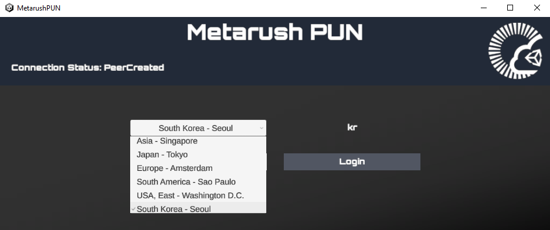
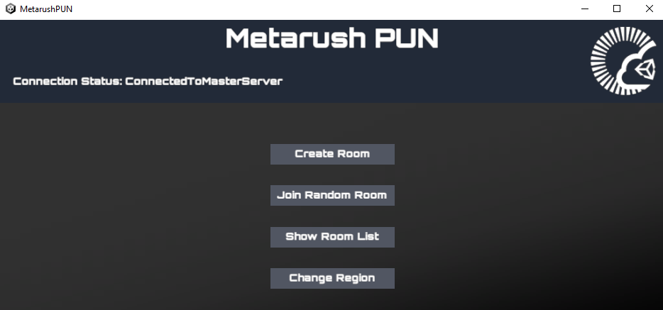
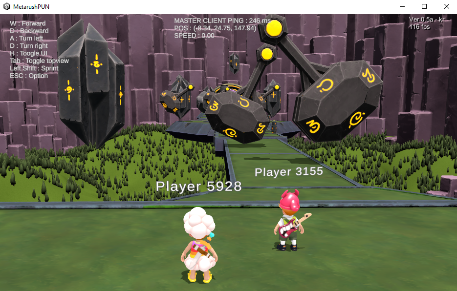

# MetarushPUN — Fall Guys-style Multiplayer Prototype

Photon에서 제공하는 **PUN(Photon Unity Networking) Lobby 샘플**을 기반으로, **Fall Guys**를 벤치마킹하여 구현한 멀티플레이어 프로토타입입니다. 리전 선택 → 룸 생성/참가 → 게임 시작으로 이어지는 Photon PUN의 표준 매치메이킹 흐름 위에, 더블 점프·체크포인트 리스폰 등 캐주얼 레이싱 장르에 필요한 게임플레이 로직을 얹어 검증했습니다.

---

## 빌드 다운로드

▶ [Windows 빌드 다운로드](https://drive.google.com/file/d/1uhwscE3nmQTjUshX3ybWRRV_59VS3g-P/view?usp=sharing)

여러 인스턴스를 동시에 실행하여 로컬에서 멀티플레이 테스트가 가능합니다. (자세한 실행 방법은 아래 참고)

---

## 실행 순서

동일한 빌드를 여러 인스턴스로 동시에 실행하여, 하나는 호스트로 룸을 생성하고 나머지는 해당 룸에 참가하는 방식으로 멀티플레이를 테스트합니다.

### 1. 서버(리전) 선택 및 로그인

여러 인스턴스를 동시에 실행할 수 있으며, 각 인스턴스에서 접속할 Photon 리전을 선택한 뒤 로그인합니다. 모든 플레이어가 같은 룸에서 만나려면 **동일한 리전**을 선택해야 합니다.

### 2. 룸 생성 및 참가

로그인 후 마스터 서버에 접속되면 메뉴가 표시됩니다. 호스트 플레이어가 **Create Room**으로 룸을 생성하면, 다른 플레이어는 **Join Random Room** 또는 **Show Room List**를 통해 해당 룸에 참가할 수 있습니다.

### 3. 게임 시작

룸에 모든 플레이어가 모이면, 호스트 유저가 **Start Game** 버튼을 눌러 게임을 시작합니다. 게임이 시작되면 모든 클라이언트가 동일한 맵으로 진입하여 플레이합니다.

---

## 조작 및 기능

| 입력 | 동작 |
|---|---|
| 스페이스바 더블클릭 | 더블 점프 |
| Tab | 시점 변경(3인칭 ↔ 탑뷰) |
| 왼쪽 Shift | 스프린트 |
| ESC | 옵션 |

맵 중간중간에는 **체크포인트**가 설정되어 있어, 플레이어가 맵 아래로 추락하면 마지막으로 통과한 체크포인트 지점에서 캐릭터가 리스폰됩니다.

---

## 대규모 인원 수용을 위한 검증: Photon Quantum 전환

PUN 기반 프로토타입으로 코어 게임플레이를 검증한 이후, **30명 이상의 동시 접속 인원**을 안정적으로 수용해야 하는 요구사항에 맞춰 **Photon Quantum**으로 전환하여 개발을 진행했습니다. PUN은 상태 동기화 방식(State Sync) 특성상 대규모 동시 접속 시 대역폭·연산 부하가 급격히 증가하는 한계가 있어, deterministic simulation 기반의 Quantum이 다수 인원의 물리 기반 레이싱 콘텐츠에 더 적합하다고 판단했습니다.

> 현재 Quantum 기반으로 개발한 실제 빌드는 보유하고 있지 않아, 대신 아래 영상으로 플레이 모습을 대체합니다.
>
> 🔗 [https://x.com/PlayMetarush](https://x.com/PlayMetarush)

---

## 기술 스택

- **Engine**: Unity
- **Networking (Prototype)**: Photon PUN (Photon Unity Networking) — Lobby 샘플 기반
- **Networking (Scale-up)**: Photon Quantum — deterministic simulation 기반 대규모 동시접속 대응
- **Genre**: Casual Multiplayer Racing/Party (Fall Guys 벤치마킹)
